# Mahgen

English | [中文](./README.md)

 |
 |


`mahgen` is a library that generates tile images for given Japanese mahjong patterns. `mahgen` is the abbreviation for ***Mah**jong* ***Gen**erator*.

---

## Features

`mahgen` supports various tile patterns, for example:

* Basic


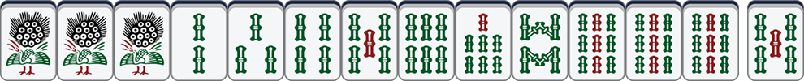

* Chii


* Pon

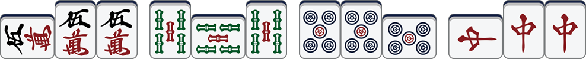

* Kan

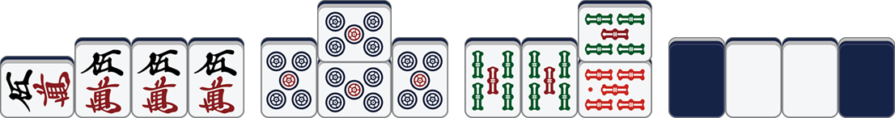

* Red Dora

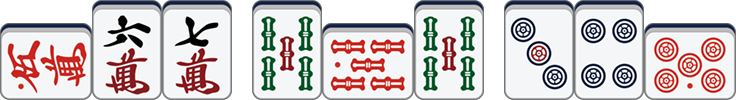

You can visit [this website](https://mahgen.ericlab.cc) which uses `mahgen` to generate your own tile images online ans save them locally for other uses. For example, the tile images shown above were all generated by the site.

---

## Installation

**Use  CDN**

You can use `mahgen` directly from a CDN via a script tag:

```html
<script src="https://unpkg.com/mahgen/dist/index.umd.js"></script>
```

You can also download this file and serve it yourself.

**Use NPM**

You can also use `npm` and execute:

```shell
npm install --save mahgen
```

---

## Usage

`mahgen` defines a new custom HTML tag called `<mah-gen>`, and you can specify the pattern of the tile image generated by the tag via the `data-seq` attribute. 

Below is a simple example of using `mahgen`:

```html
<!doctype html>
<html lang="en" data-theme="light">
<head>
    <meta charset="utf-8">
    <meta name="viewport" content="width=device-width, initial-scale=1">
    <title>Mahgen Example</title>
    <script src="https://unpkg.com/mahgen/dist/index.umd.js"></script>
</head>
<body>
    <h1>Mahgen Example</h1>
    <mah-gen data-seq="123m|456p"></mah-gen>
</body>
</html>
```

You can check [this demo](https://jsfiddle.net/eric200203/qLghnmus) to see how it renders.

---

## API

`mahgen` also provides the following API:

```
Mahgen.render(seq: string): Promise<string>;
```

Where:

* `seq` is a string used to describe the pattern(we will describe its syntax in the next section);
* The return value is the base64 data of the generated image, which can be used in e.g. the `src` attribute of the `` tag in HTML.

Note that this is an asynchronous function, so you may need `await` keyword or `.then()` method to retrieve the result.

If the input sequence is not syntactically correct, the function throws an exception of type `ParseError`, which can be caught by `try...catch` statement or `.catch()` method. `ParseError` contains the following two members:

* `code`: an enumeration of type `ErrorCode`, indicating the reason of the error.
* `index`: a number indicating the position of the error(0-based).

In fact, custom tag `<mah-gen>` is just a wrapper on top of this API.

---

## Syntax

### Numbered Suits(Pin, So, Man)

In Japanese mahjong, the digits `1-9` are usually used to describe the number of a tile, and the letters `p`, `s`, `m` to describe the suit `Pin`, `So`, `Man`. Therefore, the sequence `1m2m3m` would indicate the pattern *1-wan, 2-wan, 3-wan*, and `5p6p7p` *5-pin, 6-pin, 7-pin*.

> *1m2m3m*
>
> 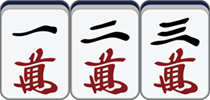

> *5p6p7p*
>
> 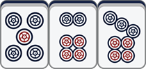

In particular, we use the number `0` to denote a red dora, so `0p`, `0s`, `0m` denote *red 5-pin, red 5-so, red 5-wan*, respectively:

> *0p、0s、0m*
>
> 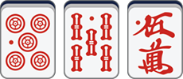

For tiles of the same suit, You can omit all the letters except for the last one for simplicity. For example, you can simplify `1m2m3m` to `123m` and `5p6p7p` to `567p`. You can also write `1m23m` or `12m3m` for they all represent the pattern *1-wan, 2-wan, 3-wan*

### Honor Tiles(Wind Tiles, Dragon Tiles)

The letter `z` is used to represent the honor tiles in Japanese mahjong, with the order "Ton, Nan, Sha, Pei, Haku, Hatsu, Chun". So `1z 2z 3z 4z 5z 6z 7z` represent *Ton, Nan, Sha, Pei, Haku, Hatsu, Chun*, respectively.

> *1z 2z 3z 4z 5z 6z 7z*
>
> 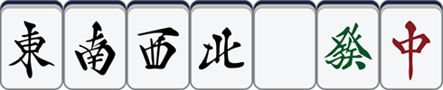

On this basis, we use `0z` to denote *the back of a tile*. For example, we can use `0z11p0z` to represent *a closed quad of 1-pin*:

> *0z11p0z*
>
> 

Finally, in order to make all the digits meaningful to the honor tiles, we use `8z` and `9z` for two tiles that do not appear in Japanese mahjong, but may be useful: *? and &ast;*.

> *8z、9z*
>
> 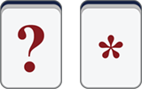

Finally, like the numbered suits, honor tiles can be simplified. For example, `3z3z3z` can be abbreviated to `333z`.

## Spaces

We use `|` to insert a space between two tiles, each space is 1/7 the width of a tile. For example:

> *123p|456s|789m*
>
> 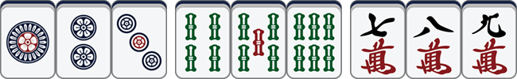

You can control the width of the space between two tiles by inserting multiple consecutive spaces with multiple `|`.

> *123p||||456s*
>
> 

## Naki

There are three possible variations for a mahjong tile when tile open calls: side, added open quad, or added open quad with red dora involved.

### Side

We use the prefix `_` to indicate that the next tile is placed horizontally. For example, we can use `_123m` to represent a call out of *Chii*:

> *_123m*
>
> 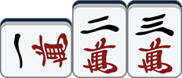

Here are some more examples:

> *1_11s*
>
> 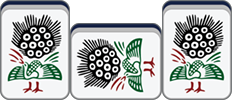

> *777_7p*
>
> 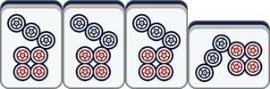

### Added open quad

We use the prefix `^` to indicate that the next tile is an overlap formed by added open quad. For example:

> *77^7z*
>
> 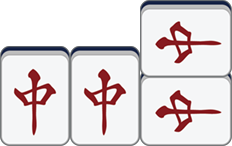

### Added open quad, involving red dora

We use the prefix `v` to represent that the next tile is an overlap formed by added open quad, while one of them is a red dora. We define that `v0` means the lower tile in the overlap is a red dora, and `v5` means the upper tile in the overlap is a red dora. For example:

> *55v5p*
>
> 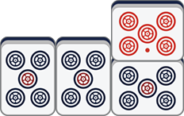

> *5v05s*
>
> 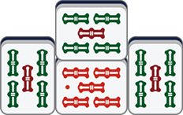

> *v555m*
>
> 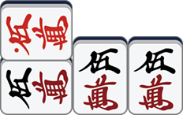

### Summary

The syntax of `mahgen` basically follows and expands upon the conventions of Japanese mahjong for describing tile patterns:

* Use `1-9` to describe the number of tiles;
* Use `p`, `s`, `m` and `z` to indicate the type of tiles: Pin, So, Man and Honor tiles;
* Use `0` for red dora, `0z` for the back of a tile;
* Use `|` to insert a space;
* Use prefix `_` to indicate placing a tile horizontally, `^` to added open quads, and `v` to added open quads with red dora involved.

By combing these symbols, we are able to construct a variety of tile patterns, for example:

> *1m|_123p|5v05m|0z11s0z|66^6z*
>
> 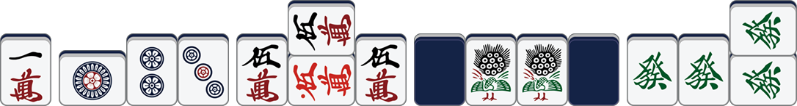

Finally, `mahgen` only generates images for given sequences and does not check whether these sequences match the rules, so sequences like `_5^50v0m` are legal for `mahgen`.

---

## TODO

* Support for parameters like scaling, ...
* Support for river mode...

---

## Acknowledgements

* Thanks to [@black-desk](https://github.com/black-desk), whose project [mahjim](https://github.com/black-desk) greatly inspired this project.
* Thanks to [最完整的日本麻将中文维基百科](http://wiki.lingshangkaihua.com/mediawiki/index.php/%E9%A6%96%E9%A1%B5), for the image materials for this project came from this site.

---

## License

[MIT](./LICENSE)

---

## Changelog

### v0.3.0

First version of `mahgen`.