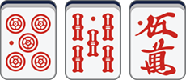

# 🀄️mahgen

[English](./README.EN.md) | 中文

 | 
 | 


`mahgen` 是一个为给定的日本麻将的牌型生成对应牌面图片的工具库。`mahgen` 是 ***Mah**jong* ***Gen**erator* 的缩写。

---

## 特性

`mahgen` 支持各种牌型的表示，例如：

* 基本牌型


* 吃


* 碰


* 杠


* 红宝牌


你可以访问 [这个网站](https://mahgen.ericlab.cc) 进行体验，它使用了 `mahgen` 在线生成用户指定的牌型图片，这些图片可以保存到本地用于其他用途。例如，上面展示的麻将牌型图片都是使用这个网站生成的。

---

## 安装

**使用 CDN**

你可以借助 `script` 标签直接通过 CDN 来使用 `mahgen`：

```html
<script src="https://unpkg.com/mahgen/dist/index.umd.js"></script>
```

你也可以将这一文件下载到本地并自行提供服务。

**使用 NPM**

另外，你也可以使用 `npm` 安装 `mahgen`：

```shell
npm install --save mahgen
```

---

## 用法

`mahgen` 定义了一个新的 HTML 标签 `<mah-gen>`，你可以通过 `data-seq` 属性指定这个标签所生成图片的牌型（其语法见后文）。

下面是一个使用 `mahgen` 的简单示例：

```html
<!doctype html>
<html lang="en" data-theme="light">
<head>
    <meta charset="utf-8">
    <meta name="viewport" content="width=device-width, initial-scale=1">
    <title>Mahgen Example</title>
    <script src="https://unpkg.com/mahgen/dist/index.umd.js"></script>
</head>
<body>
    <h1>Mahgen Example</h1>
    <mah-gen data-seq="123m|456p"></mah-gen>
</body>
</html>
```

你可以在 [JSFiddle](https://jsfiddle.net/eric200203/qLghnmus) 在线查看它的渲染结果。

---

## API

`mahgen` 还提供了如下的 API：

```
Mahgen.render(seq: string): Promise<string>;
```

其中：

* 参数 `seq` 是用于描述牌型的字符串序列（其语法见下节）；
* 返回值是所生成的图片结果的 base64 数据，它可以用于如 HTML 中 `` 标签的 `src` 属性。

请注意这是一个异步函数，因此你可能需要使用 `await` 关键字或 `.then()` 方法获取其执行结果。

如果输入的序列不符合语法规范，则该函数会抛出类型为 `ParseError` 的异常，你可以使用 `try...catch` 语句或 `.catch()` 方法将其捕获。`ParseError` 异常类包含下面两个成员：

* `code`：`ErrorCode` 类型的枚举，表示错误的类别；
* `index`：表示错误出现的位置（下标从0开始）。

实际上，自定义标签 `<mah-gen>` 就是在这一 API 的基础上所进行的封装。

---

## 语法

### 数牌（饼、索、万）

在日本麻将中，通常使用数字 `1-9` 描述牌的点数，使用字母 `p`、`s`、`m` 描述牌的类型 *饼 Pin*、*索 So*、*万 Man*。因此，序列 `1m2m3m` 就表示牌型 *一万二万三万*，`5p6p7p` 则表示 *五饼六饼七饼*。

> *1m2m3m*
> 
> 

> *5p6p7p*
>
> 

特别地，我们使用数字 `0` 表示红宝牌，因此 `0p`、`0s`、`0m` 分别表示 *红五饼、红五索、红五万*：

> *0p、0s、0m*
> 
> 

为了简化书写，你可以将同一类型的牌的类型描述全部省略，只保留最后一个。例如，你可以将上文中的 `1m2m3m` 简写为 `123m`，`5p6p7p` 简写为 `567p`。当然，你也可以写作 `1m23m` 或 `12m3m`，它们都表示 *一万二万三万* 这个牌型。

### 字牌（风牌、三元牌）

日本麻将使用字母 `z` 表示字牌，且字牌的顺序为"东南西北白发中"，因此 `1z 2z 3z 4z 5z 6z 7z` 就分别表示 *东 南 西 北 白 发 中*。

> *1z 2z 3z 4z 5z 6z 7z*
> 
> 

在此基础上，我们使用 `0z` 表示 *牌背*。例如，我们可以使用 `0z11p0z` 表示 *暗杠一饼*：

> *0z11p0z*
> 
> 

最后，为了让所有的数字对字牌都有意义，我们使用 `8z` 和 `9z` 表示两张并不在日本麻将中出现、但可能有用处的牌： *? 和 &ast;*。

> *8z、9z*
> 
> 

和数牌一样，字牌也可以简写，例如 `3z3z3z` 可以简写为 `333z`。

## 空格

我们使用 `|` 在两张牌之间插入 *空格*，每个空格是 1/7 张牌的宽度。例如：

> *123p|456s|789m*
> 
> 

你可以连续使用多个 `|` 插入多个连续的空格来控制两张牌之间空格的宽度：

> *123p||||456s*
> 
> 

## 副露

副露时，麻将牌可能会发生以下三种变化：横置、加杠以及涉及红宝牌的加杠。

### 横置

我们使用前缀 `_` 表示将紧接着的下一张牌横置。例如，我们可以使用 `_123m` 表示 *使用二万和三万吃上家打出的一万*：

> *_123m*
> 
> 

这里有更多的示例：

> *1_11s*
>
> 

> *777_7p*
>
> 

### 加杠

我们使用前缀 `^` 表示紧接着的下一张牌是加杠形成的重叠。例如：

> *77^7z*
> 
> 

### 涉及红宝牌的加杠

我们使用前缀 `v` 表示紧接着的下一张牌是加杠形成的重叠，且其中有一张牌是红宝牌。我们定义：`v0` 表示重叠中靠下的牌是红宝牌，靠上的牌是普通数牌；`v5` 表示重叠中靠下的牌是普通数牌，靠上的牌是红宝牌。例如：

> *55v5p*
> 
> 

> *5v05s*
> 
> 

> *v555m*
> 
> 

### 总结

`mahgen` 的语法基本遵循日本麻将描述牌型的惯例，并在其基础上进行扩展 ：

* 使用 `1-9` 描述牌的点数；
* 使用后缀 `p、s、m、z` 表示牌的类型：饼、索、万和字牌；
* 使用 `0` 表示红宝牌，`0z` 则表示牌背；
* 使用 `|` 插入空格；
* 使用前缀 `_` 表示将牌横置，`^` 表示加杠，`v` 表示涉及红宝牌的加杠。

将这些符号组合起来，我们就能够构造出各种各样的牌型，例如：

> *1m|_123p|5v05m|0z11s0z|66^6z*
> 
> 

最后，`mahgen` 只为给定的序列生成图片，不会对序列是否符合牌理进行检查，因此诸如 `_5^50v0m` 的序列对 `mahgen` 而言同样是合法的。

---

## 后续开发计划

* 支持缩放等参数设置
* 支持牌河模式显示

---

## 致谢

* 感谢 [@black-desk](https://github.com/black-desk) ，他的项目 [mahjim](https://github.com/black-desk) 为本项目提供了灵感。
* 感谢 [最完整的日本麻将中文维基百科](http://wiki.lingshangkaihua.com/mediawiki/index.php/%E9%A6%96%E9%A1%B5)，本项目的图片素材来源于这个网站。

---

## 许可证

[MIT](./LICENSE)
