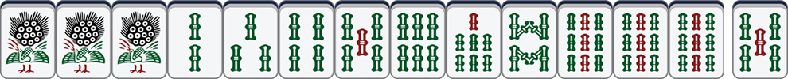
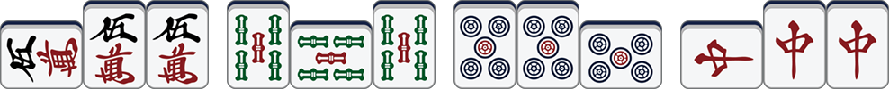
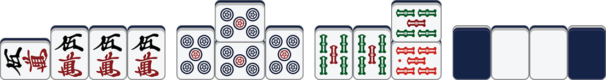

# 🀄️mahgen

[English](./README.md) | 中文

`mahgen` 是一个为给定的日本麻将的牌型生成对应牌面图片的工具库。`mahgen` 是 ***Mah**jong* ***Gen**erator* 的缩写。

## 特性

`mahgen` 支持各种牌型的表示，例如：

* 基本牌型

* 吃

* 碰

* 杠

* 红宝牌

您可以访问 [这个网站](https://eric200203.github.io/frap-book-zh) 在线生成自己想要的牌型图片，并将它们保存到本地用于其他用途。

